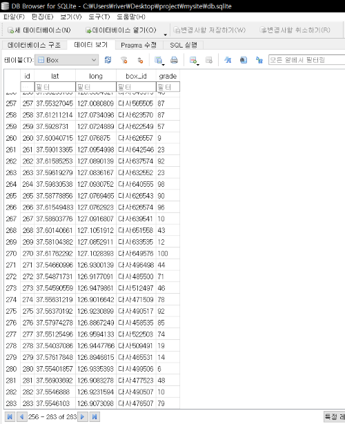

# 커피박 수거 시스템 (Coffee in Seoul)
> 해당 프로젝트는 커피박 활용에 관심을 늘리고 참여할 수 있도록 웹사이트를 구축하였다.
[구글드라이브](https://drive.google.com/drive/folders/1DVZ5E7FPPdHe3GUF9UNz1JnWwrk_RUzd)

# 사용방법
>가상환경을 생성하여 flask를 통해 서버를 구동할 수 있다. 

## 1. 로그인 및 회원가입
> 회원가입을 통해 개인 아이디를 생성할 수 있다.
>
>아이디 생성 이후 로그인할 수 있다.


## 2. 홈
> 홈페이지이다


 
## 3. 가이드
> 서비스를 이용할 수 있는 가이드이다.

 
 
## 4. 소개
> 서비스에 대한 소개이다.


## 5. 수거함
> 최종 입지로 선정된 수거함의 위치를 지도에 표시하였다.

> 수거함 마커를 클릭시 입력을 받을 수 있다.

 
 
## 6. 입력
> 해당 수거함에 커피박 수거량을 입력받을 수 있게 하였다.


## 7. 내정보
> 유저의 커피박 수거량과 마일리지를 확인할 수 있다.


# 프로젝트 코드(파이썬)
> 해당 웹사이트는 flask 프레임워크를 이용하여 제작하였으며, SQLAlchemy를 이용하여 데이터베이스를 구축하였다.

## 파이썬 코드
+ app.py
```
#카페박csv읽기
file='./static/csv/coffeebak.csv'
a=pd.read_csv(file, encoding='cp949')
point=DataFrame(a, columns=['이름','지역구','위도','경도'])  #이름,지역구,위도,경도 칼럼들만 추출하여 생성
point.dropna()
#최종 선정된 수거함의 입지가 저장된 csv파일을 읽어들여서 point라는 데이터프레임으로 생성
```
```
#수거함 db 생성
def create():
    for y, x, name in zip(point['위도'], point['경도'], point['이름']):
        box = Box()
        box.lat = y
        box.long = x
        box.box_id = name
        box.grade = randint(1, 100)  #임시로 랜덤값을 배정
        db.session.add(box)
        db.session.commit()
#point 데이터프레임의 정보들을 Box라는 데이터베이스로 생성
#Box 데이터베이스는 위도,경도,이름,포화도로 구성
```
```
#홈페이지
@app.route("/")
def main():
    box = Box.query.filter_by().all()
    if box: #Box 데이터베이스가 없을시에만 생성
        a=1
    else:
        create()
    return render_template("index.html")
    #index.html을 렌더링하여 브라우저에 출력
```
```
#회원가입
@app.route("/signup", methods=["GET","POST"])
def signup():
    form = SignupForm()
    if form.validate_on_submit():
        select_user = User.query.filter_by().all()
        for user in select_user:
            if user.user_id == form.data.get('user_id'):  #입력받은 아이디가 이미 존재할시
                flash('중복된 아이디입니다.')
                return redirect('/signup')   #회원가입 페이지로 다시 돌아감

        usernum=0
        for user in select_user:
            usernum+=1  #시리얼 넘버를 선언하기 위한 변수

        #유저 db 생성
        user = User()
        user.user_id = form.data.get('user_id')
        user.user_pw = form.data.get('user_pw')
        user.mileage = 0
        user.serial_num = "s" + "{:0>8}".format(1 + usernum)  #기존에 존재하는 유저들과 다른 시리얼넘버 생성

        db.session.add(user)
        db.session.commit()
        flash('회원가입 완료')

        return redirect('/login')

    return render_template('signup.html', form=form)
    #signup.html을 렌더링하여 브라우저에 출력, 회원가입form을 html로 넘겨줌
#회원가입 폼을 생성하고 아이디와 비밀번호를 입력받음
#아이디, 비밀번호, 마일리지(커피박수거량), 시리얼넘버로 User 데이터베이스 생성
```
```
#로그인
@app.route("/login", methods=["GET","POST"])
def login():
    form = LoginForm()
    if form.validate_on_submit():
        select_user = User.query.filter_by().all()
        for user in select_user:
            if user.user_id == form.data.get('user_id') and user.user_pw == form.data.get('user_pw'):
                session['user_id'] = form.data.get('user_id')  #세션에 유저아이디 올림
                return redirect('/')
                #로그인 성공시 홈페이지 이동

        flash('잘못된 아이디와 비밀번호입니다.')
        return redirect('/login')
        #로그인 실패시 메시지를 띄우고 로그인페이지로 다시 돌아감

    return render_template('login.html', form=form)
    #login.html을 렌더링하여 브라우저에 출력, 로그인form을 html로 넘겨줌
#로그인 폼을 생성하고 유저 데이터베이스에 있는 정보와 아이디와 비밀번호가 모두 일치하게 입력시 로그인 완료
```
```
#로그아웃
@app.route('/logout',methods=['GET'])
def logout():
    session.pop('user_id',None)
    return redirect('/')
#세션에 올려져 있는 유저아이디를 삭제하고 로그아웃 완료
```
```
#소개
@app.route("/intro",methods=['GET','POST'])
def intro():
    return render_template('intro.html')
    #intro.html을 렌더링하여 브라우저에 출력
```
```
#가이드
@app.route("/guide",methods=['GET','POST'])
def guide():
    return render_template('guide.html')
    #guide.html을 렌더링하여 브라우저에 출력
```
```
#지도
@app.route('/map',methods=["GET","POST"])
def map() :
    r = requests.get('https://raw.githubusercontent.com/southkorea/seoul-maps/master/kostat/2013/json/seoul_municipalities_geo_simple.json') #서울 json 불러옴
    c = r.content
    seoul_geo = json.loads(c)

    #folium 지도생성
    map = folium.Map(
        location=[37.55,126.98], #서울 위치
        zoom_start=11,
        width='100%', height='100%',
        tiles='cartodbpositron'
    )


    # 서울을 지역구로 구역을 나주어줌
    folium.GeoJson(
        seoul_geo,
        name='지역구'
    ).add_to(map)

    marker_cluster = MarkerCluster().add_to(map)  # 폴리움에 마커를 생성할 수 있음

    #내위치 마킹(chromedriver api이용)
    options = Options()
    options.add_argument("--use--fake-ui-for-media-stream")
    driver = webdriver.Chrome(executable_path='./chromedriver.exe',options=options)  # 크롬드라이버 경로 설정
    timeout = 20
    driver.get("https://mycurrentlocation.net/")
    wait = WebDriverWait(driver, timeout)
    time.sleep(3)
    longitude = driver.find_elements_by_xpath('//*[@id="longitude"]')  # xpath대체
    longitude = [x.text for x in longitude]
    longitude = str(longitude[0])
    latitude = driver.find_elements_by_xpath('//*[@id="latitude"]')
    latitude = [x.text for x in latitude]
    latitude = str(latitude[0])
    driver.quit()

    #위 코드 불가시 사용(geocoder.ip사용)
    #g = geocoder.ip('me')
    #latitude=g.latlng[0]
    #longitude=g.latlng[1]

    folium.Marker([latitude, longitude], icon=folium.Icon(color='blue'), popup='me').add_to(map) #내위치를 지도에 마킹
    x1=0
    y1=0
    y1+=float(latitude)
    x1+=float(longitude)
    #내위치의 위도와 경도를 각각 y1,x1으로 저장


    #내위치 주소로 변환(kakao api이용)
    url = "https://dapi.kakao.com/v2/local/geo/coord2regioncode.json?x="+str(longitude)+"&y="+str(latitude)
    headers = {"Authorization": "KakaoAK 2f2ca77cb2ac3dae5aae44e0c67c6dbd"}
    api_test = requests.get(url, headers=headers)
    url_text = json.loads(api_test.text)
    address=url_text['documents'][0]['address_name'] #내위치의 주소를 저장


    #가까운 수거함
    short = 100000
    place = 'a'
    for y, x, name in zip(point['위도'], point['경도'], point['이름']):
        a = (y, x)
        b = (y1, x1)
        distance = haversine(a, b) #내위치와 수거함의 위치를 통해 거리계산
        if short > distance: #계산된 거리가 short보다 짧을시
            short = distance
            place = name
            shortx= x
            shorty= y
    #수거함 중에 현재위치와 가장 거리가 가까운 수거함을 탐색
    #이때 가장 짧은거리는 short, 수거함의 이름은 place, 위도,경도는 shorty.shortx로 저장


    #수거함 마킹
    select_box = Box.query.filter_by().all()
    for box in select_box:
        grade=float(box.grade)  #포화도
        lat=float(box.lat)  #위도
        long=float(box.long)  #경도
        name=box.box_id  #이름
        if 90>grade>=70:
            if lat==shorty and long==shortx:
                folium.Marker([box.lat, box.long], icon=folium.Icon(color='black', icon='trash'), popup='<a href=http://127.0.0.1:5000/input/'+name+' target=_blink>입력</a>', tooltip= box.box_id+' (보통)' , ).add_to(map)
            else:
                folium.Marker([box.lat, box.long], icon=folium.Icon(color='orange', icon='trash'), popup='<a href=http://127.0.0.1:5000/input/'+name+' target=_blink>입력</a>', tooltip=box.box_id+' (보통)' , ).add_to(marker_cluster)
        elif grade>=90:
            if lat == shorty and long == shortx:
                folium.Marker([box.lat, box.long], icon=folium.Icon(color='black', icon='trash'), popup='<a href=http://127.0.0.1:5000/input/'+name+' target=_blink>입력</a>', tooltip=box.box_id + ' (포화)', ).add_to(map)
            else:
                folium.Marker([box.lat, box.long], icon=folium.Icon(color='red', icon='trash'), popup='<a href=http://127.0.0.1:5000/input/'+name+' target=_blink>입력</a>', tooltip=box.box_id + ' (포화)', ).add_to( marker_cluster)
        else:
            if lat == shorty and long == shortx:
                folium.Marker([box.lat, box.long], icon=folium.Icon(color='black', icon='trash'), popup='<a href=http://127.0.0.1:5000/input/'+name+' target=_blink>입력</a>', tooltip=box.box_id+' (여유)', ).add_to(map)
            else:
                folium.Marker([box.lat, box.long], icon=folium.Icon(color='green', icon='trash'), popup='<a href=http://127.0.0.1:5000/input/'+name+' target=_blink>입력</a>', tooltip=box.box_id+' (여유)', ).add_to(marker_cluster)
    #수거함의 위치를 지도에 마킹하기 위해 Box데이터베이스를 참조하여 하나씩 마킹
    #각 수거함의 포화도에 따라 마커의 색깔이 달라지며, tooltip에 수거함의 이름, 포화도 등급을 표기
    #각 수거함의 마커를 누를시 popup창이 뜨는데, 입력버튼을 누를시에 input.html창을 새로 띄운다.(커피박 수거량 입력 가능)
    
    
    #선그리기
    data=[[y1,x1],[shorty,shortx]]
    folium.PolyLine(locations=data, color='red', tooltip='Path').add_to(map)
    #내위치와 가장 가까운 수거함의 위치를 선으로 그려줌

    maps=map._repr_html_()  #지도를 템플릿에 삽입하기위해 iframe이 있는 문자열로 반환 (folium)

    return render_template('map.html', map=maps, short=short, place=place, x1=x1, y1=y1, address=address, )
    #map.html을 렌더링하여 브라우저에 출력, 지도(map), 가장 가까운 수거함의 거리(short), 이름(name), 위도(y1), 경도(x1), 현재위치주소(address)를 html로 넘겨줌    
```
```
#커피박 입력
@app.route('/input/<name>',methods=["GET","POST"])
def input(name):
    form = MileageForm()
    if form.validate_on_submit():
        a= User.query.filter_by().all()
        for user in a:
            if user.user_id == session['user_id']: #세션에 있는 아이디와 User db의 아이디가 일치할시(로그인시)
                mileage=float(user.mileage)+float(form.data.get('mileage'))
                user.mileage=mileage #유저의 커피박 수거량 증가

                c=Box.query.filter_by().all()
                for box in c:
                    if box.box_id == name:
                        grade=float(box.grade)+float(form.data.get('mileage')) #해당 수거함의 포화도 증가
                        box.grade=grade
                        db.session.commit()
                        flash('입력 완료')
                        return redirect('/map')
                        #성공시 지도페이지로 돌아감

    return render_template('input.html', form=form, Box=Box.query.all(), name=name )
    # input.html을 렌더링하여 브라우저에 출력, 입력폼과, Box데이터베이스, 박스이름을 넘겨줌
#커피박 수거량을 입력받을 수 있는 폼을 생성, 값 입력시 해당 Box db의 포화도와 User db의 마일리지값이 입력값만큼 증가함
```
```
#내정보
@app.route('/myinfo',methods=['GET','POST'])
def myinfo():
    a = User.query.filter_by().all()
    for user in a:
        if user.user_id == session['user_id']: #로그인시에만 접근 가능
            mileage = float(user.mileage)

    return render_template('myinfo.html', User=User.query.all(), mileage=mileage, point=int(mileage*100))
    # myinfo.html을 렌더링하여 브라우저에 출력, User 데이터베이스, 마일리지(커피박수거량), 포인트(마일리지 정수화)를 html로 넘겨줌
```
```
#앱 구동
if __name__ == "__main__":
    #db파일의 경로설정
    basedir = os.path.abspath(os.path.dirname(__file__))
    dbfile = os.path.join(basedir, 'db.sqlite')
    app.config['SQLALCHEMY_DATABASE_URI'] = 'sqlite:///' + dbfile
    app.config['SQLALCHEMY_COMMIT_ON_TEARDOWN'] = True
    app.config['SQLALCHEMY_TRACK_MODIFICATIONS'] = False
    app.config['SECRET_KEY'] = '0000'

    #wtf폼을 위한 CSRFProtect()호출
    csrf = CSRFProtect()
    csrf.init_app(app)

    #db 생성
    db.init_app(app)
    db.app = app
    db.create_all()

    app.run(debug=True)
```
+ database.py
```
db = SQLAlchemy()

#이용자 db 테이블
class User(db.Model):
    __tablename__ = 'User'
    id = db.Column(db.Integer, primary_key=True)
    user_id = db.Column(db.String(32))
    user_pw = db.Column(db.String(32))
    mileage = db.Column(db.String(32))
    serial_num = db.Column(db.String(32))
#유저 아이디, 비밀번호, 마일리지(커피박 수거량), 시리얼넘버로 칼럼 구성

#수거함 db 테이블
class Box(db.Model):
    __tablename__ = 'Box'
    id = db.Column(db.Integer, primary_key=True)
    lat = db.Column(db.String(32))
    long = db.Column(db.String(32))
    box_id = db.Column(db.String(32))
    grade = db.Column(db.String(32))
#수거함 위도, 경도, 이름, 포화도로 칼럼 구성
```
+ form.py
```
#회원가입 폼
class SignupForm(FlaskForm):
    user_id = StringField('user_id', validators=[DataRequired()])
    user_pw = PasswordField('user_pw', validators=[DataRequired(), EqualTo('re_pw')])
    re_pw = PasswordField('re_pw', validators=[DataRequired()])

#로그인 폼
class LoginForm(FlaskForm):
    user_id = StringField('user_id', validators=[DataRequired()])
    user_pw = PasswordField('user_pw', validators=[DataRequired()])

#커피박 수거량 입력폼
class MileageForm(FlaskForm):
    mileage= StringField('mileage',  validators=[DataRequired()])
```
+ 라이브러리
```
#app.py
import os
from flask import Flask, render_template, redirect, session, flash
from flask_wtf.csrf import CSRFProtect
import folium
import json
import pandas as pd
import requests
from pandas import DataFrame
from folium.plugins import MarkerCluster
from random import *
from haversine import haversine
from selenium import webdriver
from selenium.webdriver.chrome.options import Options
from selenium.webdriver.support.ui import WebDriverWait
import time
import geocoder
#라이브러리들은 파이참 인터프리터 설정을 통해 설치
#folium, selenium, SQLAlchemy은 cmd명령프롬프트를 통해 설치
```
```
#database.py
from flask_sqlalchemy import SQLAlchemy
```
```
form.py
from flask_wtf import FlaskForm
from wtforms import StringField, PasswordField
from wtforms.validators import DataRequired, EqualTo
```
+ 라이브러리 설치 방법
### 파이참 인터프리터
> 파이참 파일 -> 설정 -> 프로젝트 ->python 인터프리터-> +버튼을 통해 원하는 패키지설치


### CMD 명령 프롬프트
> 파이썬 인터프리터가 설치된 디렉토리로 경로 설정
 
> pip install 패키지명


### selenium 
> selenium은 내위치의 정확한 위도, 경도를 구하기 위해 설치한 패키지이다.
> 
> 이를 사용하기위해 현재 사용중인 크롬 브라우저 버전과 같은 버전의 크롬 드라이버를 다운받아야 한다.
> 
> 만일의 경우 주석으로 처리된 gecoder.ip로 대체한다.

## DataBase(db.sqlite)
> 데이터베이스 파일을 DB Browswer로 연 결과는 다음과 같다
+ User table


+ Box table



